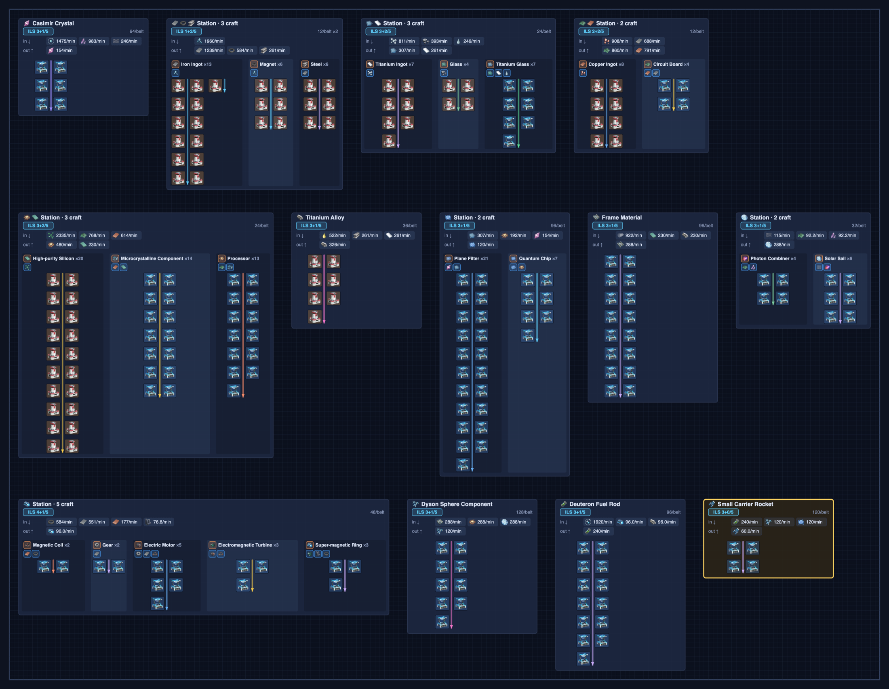
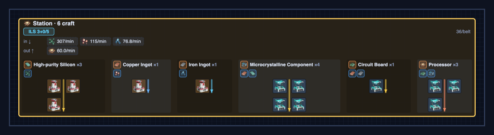
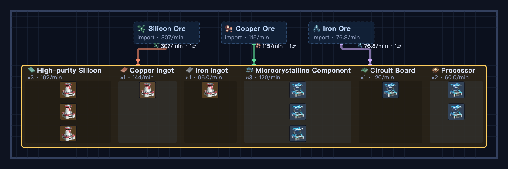

# DSP Factory Calculator

**English** · [中文](README.zh.md)

A single-page, zero-build calculator for **[Dyson Sphere Program](https://store.steampowered.com/app/1366540/Dyson_Sphere_Program/)** factories. Pick a target item and rate, and it solves the full crafting tree, packs machines into logistics stations (ILS/PLS), and draws the layout — including what each station **imports** and **exports**.

**▶ Live:** https://0fuz.github.io/dsp-calc/



## Why this, not FactorioLab?

Every other DSP calculator — FactorioLab, dyson-calculator.com, dsp-ratios.com — answers *"how many machines and belts?"* and stops at a number, a list, or an abstract Sankey/flow graph. None of them place a building or route a belt. This tool's point is the next step: it turns the ratio into a **drawable, grid-based station layout** you can use to plan a base.

- **A spatial layout, not a table.** Real DSP building footprints on a tile grid, tier-correct icons, belt counts, and two views (logistics-station *hub* and flat *belt* manifold) with pan/zoom — the step numbers-only calculators leave you to do by hand.
- **It plans your ILS/PLS stations.** Crafts are bin-packed into Interstellar / Planetary Logistics Station slot budgets, with a concrete per-station **import↓ / export↑ contract** and an over-capacity warning. No other tool models stations as logistics entities.
- **A recipe *matrix*, not a tree.** A square M·x=b system (Gaussian elimination), so oil-cracking loops, byproduct hydrogen, and self-feeding recipes balance correctly — and it errors loudly on an inconsistent recipe set instead of mis-counting.
- **Zero-install, offline.** One page, no build, no CDN; the whole build lives in a shareable compressed URL; installable as a PWA and works offline.

**Use FactorioLab instead** when you want power-draw numbers, a cost-minimizing solver that auto-picks among competing recipes, or the complete DSP recipe database. This is a focused *layout* planner on a curated recipe subset — single-planet, no power/pollution modeling, not a blueprint exporter. Use it for the spatial / station-packing step the calculators skip.

## Features

- **Recipe solver** — exact machine counts and item rates for any target item / output rate.
- **Station layout** — assemblers/smelters packed into Interstellar (ILS) and Planetary (PLS) Logistics Stations, with a per-station import↓ / export↑ contract and belt throughput.
- **Proliferator** — extra-products math (Mk.I/II/III), applied to intermediate crafts.
- **Presets** — late-game import boundaries (graphene, carbon nanotube, sulfuric acid, organic crystal, diamond, raw ores, etc.) treated as imported rather than crafted.
- **Hub & belt views** — toggle between logistics-station grouping and a flat belt layout.
- **i18n** — UI in Русский · English · 中文 with localized ILS/PLS abbreviations (МЛС/ПЛС · ILS/PLS · 星际站/行星站). Item names are localized in **English and 中文** (Russian falls back to English item names). Language persists.
- **Share links** — the full configuration (target, rate, options, view, language, panel state) is encoded in the URL.
- **Export** — copy a parts list as text, or download the layout as a PNG.
- **PWA / offline** — installable, works without a network connection after first load.
- **Responsive** — mouse pan/zoom on desktop, one-finger pan and pinch-zoom on touch.

State is saved to the URL and `localStorage`, so a link reproduces exactly what you see.

## Screenshots

A single logistics station, packed with six chained crafts — note the ILS badge, the import↓ / export↑ contract with rates, per-craft headers (item + proliferator), and the real building footprint:



The same factory in **belt view** — a flat manifold layout with import sources feeding the craft row:



## Running locally

It's a single static page — no build step. Either open `index.html` directly, or serve the folder (the service worker / PWA features need `http(s)`):

```sh
python3 -m http.server 8000
# → http://localhost:8000
```

## See also

- [Awesome Dyson Sphere Program](https://github.com/0fuz/awesome-dyson-sphere-program) — a community-curated list of DSP tools, mods, and resources (which I also maintain).

## Credits & licensing

- **Game:** *Dyson Sphere Program* © [Youthcat Studio](https://store.steampowered.com/developer/YouthcatGames/) / Gamera Games. This is an unofficial fan-made tool, not affiliated with or endorsed by the developers.
- **Icons:** sprite from **[FactorioLab](https://github.com/factoriolab/factoriolab)** (MIT License), bundled in `assets/icons.webp`.
- **This project's code** is released under the MIT License (see [`LICENSE`](LICENSE)).
