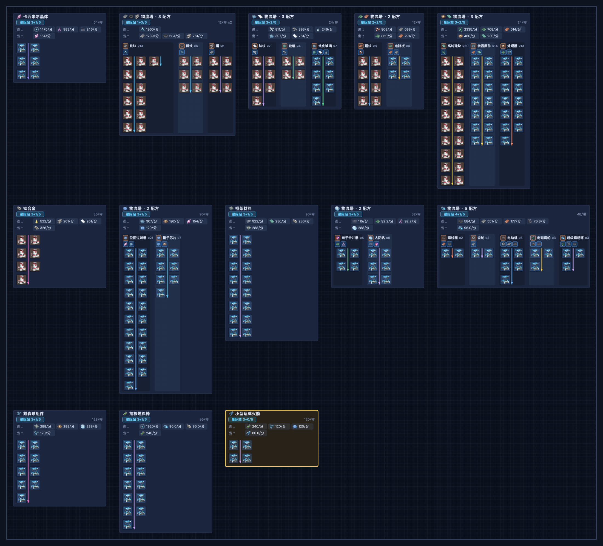
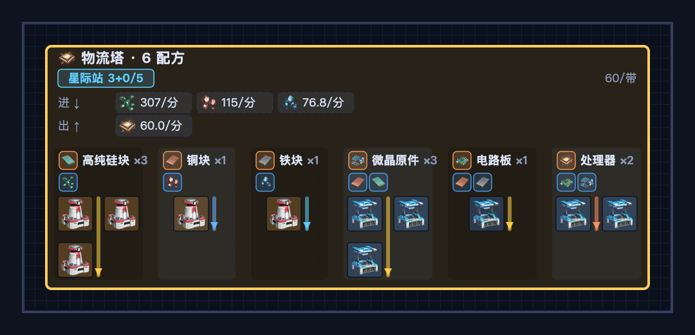
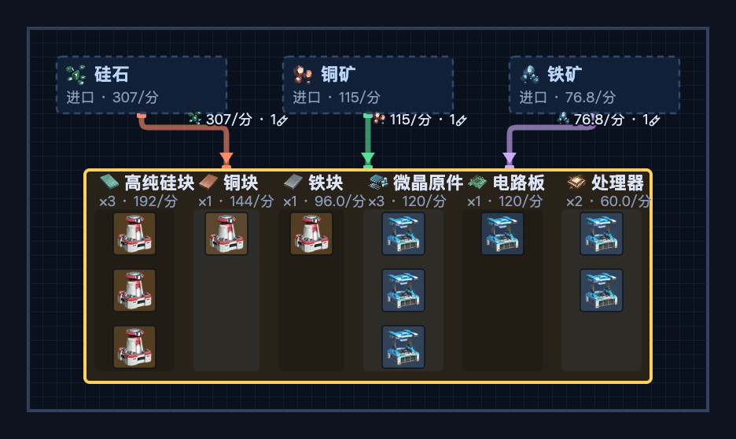

# 戴森球计划 工厂计算器

[English](README.md) · **中文**

一个零构建的单页 **[戴森球计划（Dyson Sphere Program）](https://store.steampowered.com/app/1366540/Dyson_Sphere_Program/)** 工厂计算器。选择目标物品与产量，它会求解完整的配方树、把机器打包进物流站（星际站/行星站），并画出布局——包括每座物流站**进口**和**出口**什么。

**▶ 在线使用：** https://0fuz.github.io/dsp-calc/



## 为什么用它，而不是 FactorioLab？

其他所有 DSP 计算器——FactorioLab、dyson-calculator.com、dsp-ratios.com——回答的都是*"需要多少机器和传送带？"*，止步于一串数字、一份清单，或一张抽象的桑基/流向图。它们都不会摆放任何一座建筑、铺设任何一条带子。本工具做的是下一步：把比例变成一张**可绘制的网格化物流站布局**，让你真正拿来规划基地。

- **是空间布局，不是表格。** 真实的 DSP 建筑占地画在瓦片网格上、分级正确的图标、传送带数量，以及两种视图（物流站"枢纽"视图与扁平的"传送带"总线视图）并支持平移/缩放——这正是纯数字计算器留给你手动完成的一步。
- **帮你规划星际站/行星站。** 把配方按物流站槽位预算（星际站 5 / 行星站 4）装箱，给出每座站具体的 **进↓ / 出↑ 合约**，并在进出口超过槽位时给出超容警告。没有别的工具把物流站当作物流实体来建模。
- **解的是配方*矩阵*，不是树。** 一个方阵 M·x=b 系统（高斯消元），因此炼油裂解回路、副产氢、自循环配方都能正确平衡——配方集不自洽时会明确报错，而不是默默算错。
- **零安装、可离线。** 单页、无构建、无 CDN；整套配置编码进可分享的压缩 URL；可作为 PWA 安装并离线运行。

**以下情况请改用 FactorioLab：** 需要电力消耗数字、需要在多个竞争配方间自动择优的成本最小化求解器、或完整的 DSP 配方数据库。本工具是基于精选配方子集的专注式*布局*规划器——单行星、不建模电力/污染、不导出蓝图。它只专做计算器跳过的那一步：空间布局与物流站装箱。

## 功能

- **配方求解** —— 对任意目标物品 / 产量，给出精确的机器数量与物料速率。
- **物流站布局** —— 把制造台/熔炉打包进星际站（ILS）与行星站（PLS），每座站带有进↓/出↑ 合约与传送带吞吐。
- **增产剂** —— 额外产出计算（Mk.I/II/III），作用于中间配方。
- **预设** —— 后期进口边界（石墨烯、碳纳米管、硫酸、有机晶体、金刚石、原矿等）按进口处理，而非自行制造。
- **枢纽 / 传送带 两种视图** —— 在物流站分组与扁平传送带布局之间切换。
- **多语言** —— 界面支持 Русский · English · 中文，物流站缩写本地化（МЛС/ПЛС · ILS/PLS · 星际站/行星站）；物品名仅 **English 与 中文** 本地化（俄语回退为英文物品名）。语言选择会被记住。
- **分享链接** —— 完整配置（目标、产量、选项、视图、语言、面板状态）编码进 URL。
- **导出** —— 将物料清单复制为文本，或把布局下载为 PNG。
- **PWA / 离线** —— 可安装，首次加载后无网络也能用。
- **自适应** —— 桌面端鼠标平移/缩放，触屏单指平移、双指缩放。

状态保存在 URL 与 `localStorage` 中，因此一条链接能完整重现你所见的画面。

## 截图

一座物流站，装着六个串联的配方——注意星际站徽章、带速率的进↓/出↑ 合约、每个配方的表头（物品 + 增产剂），以及真实的建筑占地：



同一座工厂的**传送带视图**——扁平的总线布局，进口源喂入配方行：



## 本地运行

它是单个静态页面——无需构建。可直接打开 `index.html`，或起一个本地服务（Service Worker / PWA 功能需要 `http(s)`）：

```sh
python3 -m http.server 8000
# → http://localhost:8000
```

## 相关

- [Awesome Dyson Sphere Program](https://github.com/0fuz/awesome-dyson-sphere-program) —— 社区整理的 DSP 工具、模组与资源清单（也由我维护）。

## 致谢与许可

- **游戏：** *戴森球计划* © [柚子猫工作室（Youthcat Studio）](https://store.steampowered.com/developer/YouthcatGames/) / Gamera Games。本工具为非官方爱好者作品，与开发者无关，也未获其背书。
- **图标：** 精灵图来自 **[FactorioLab](https://github.com/factoriolab/factoriolab)**（MIT 许可证），打包于 `assets/icons.webp`。
- **本项目代码** 以 MIT 许可证发布（见 [`LICENSE`](LICENSE)）。
